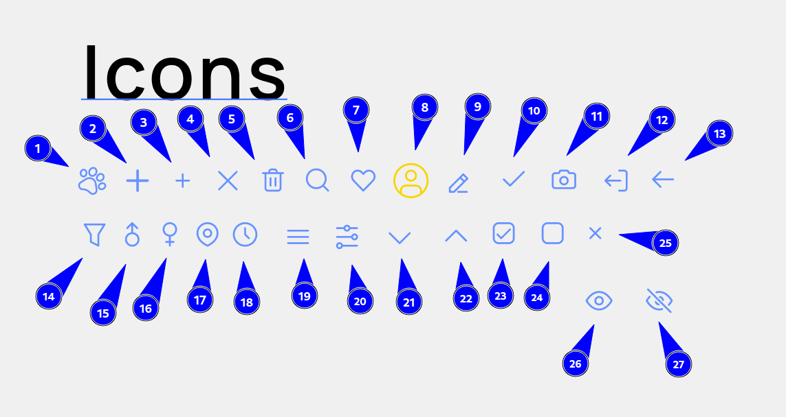

# your-pet

## Icon list



```javascript
import { VariableName } from 'shared/utils/icons';
```

| #   | Variable       | #   | Variable         | #   | Variable        |
| --- | -------------- | --- | ---------------- | --- | --------------- |
| 1   | PawPrintIcon   | 10  | PlusIcon         | 19  | PlusSmallIcon   |
| 2   | CrossIcon      | 11  | TrashIcon        | 20  | SearchIcon      |
| 3   | HeartIcon      | 12  | UserIcon         | 21  | EditIcon        |
| 4   | CheckIcon      | 13  | CameraIcon       | 22  | LogoutIcon      |
| 5   | ArrowLeftIcon  | 14  | FilterIcon       | 23  | MaleIcon        |
| 6   | FemaleIcon     | 15  | LocationIcon     | 24  | ClockIcon       |
| 7   | MenuBurgerIcon | 16  | FilterBurgerIcon | 25  | ChevronDownIcon |
| 8   | ChevronUpIcon  | 17  | CheckRoundIcon   | 26  | RoundIcon       |
| 9   | CrossSmallIcon | 18  | EyeOpenIcon      | 27  | EyeClosedIcon   |
